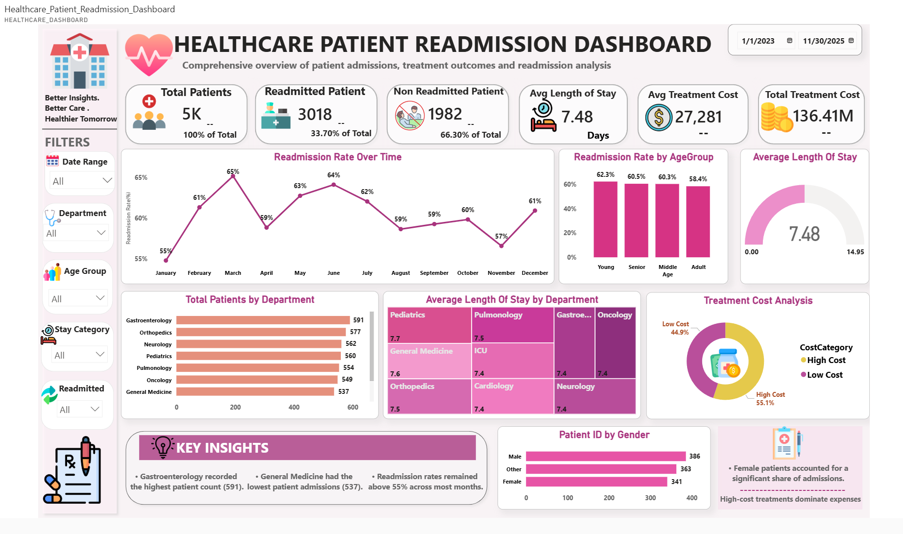
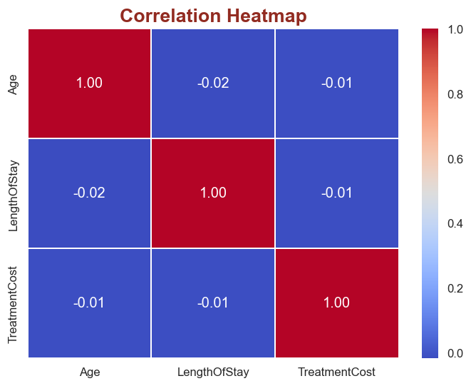
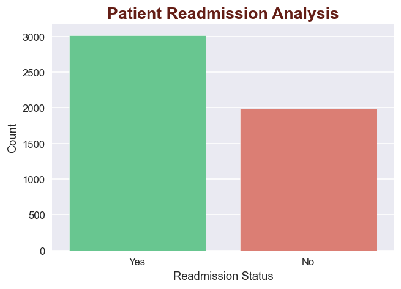
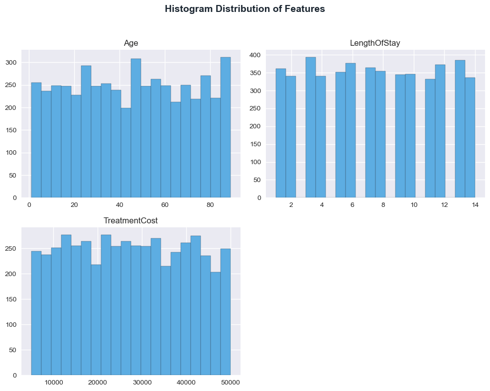
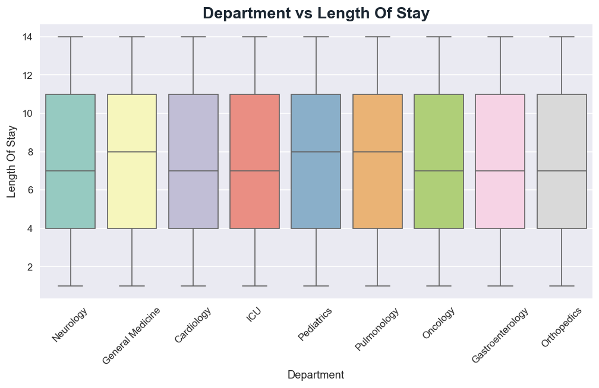
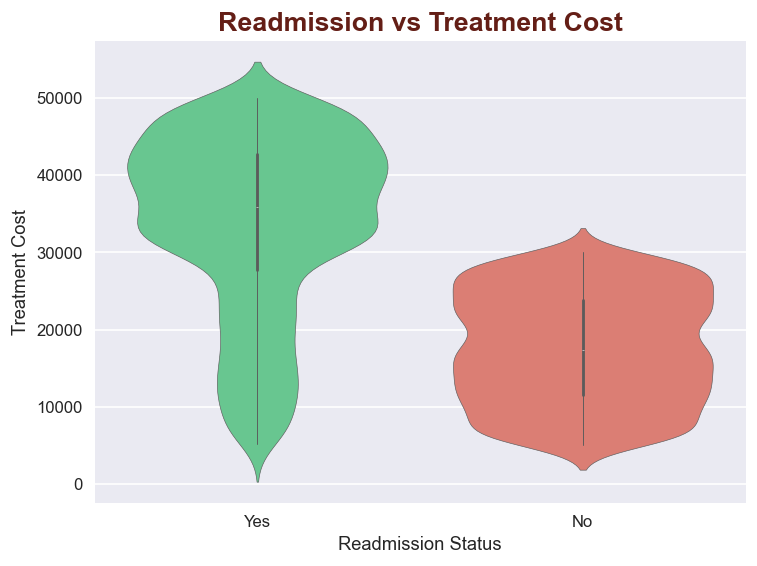

# 🏥 Healthcare Patient Readmission Analysis Project
End-to-End Healthcare Analytics Project using Python, SQL & Power BI



## 📌 Project Overview
The **Healthcare Patient Readmission Analysis Project** is an end-to-end Data Analytics project designed to analyze hospital patient data, understand readmission patterns, identify treatment cost trends, and build an interactive Power BI dashboard for decision-making.

This project covers the complete analytics workflow starting from:

✅ Exploratory Data Analysis (EDA) using Python  
✅ Data Cleaning & Query Analysis using SQL  
✅ Interactive Dashboard Creation using Power BI  
✅ Business Insights & Healthcare Reporting  

The dashboard helps healthcare organizations monitor patient admissions, treatment costs, department performance, readmission trends, and patient demographics effectively.


# 🎯 Problem Statement

Hospitals often struggle to track:
- Patient readmission patterns
- High treatment costs
- Department-wise patient load
- Average length of stay
- Readmission trends across age groups and gender

The goal of this project is to analyze healthcare data and generate actionable insights that help improve patient care and hospital performance.


# 🎯 Project Objectives

✅ Analyze patient admission and readmission behavior  
✅ Understand treatment cost distribution  
✅ Identify high-performing and low-performing departments  
✅ Track patient demographics and hospital stay duration  
✅ Create an interactive dashboard for healthcare analytics  
✅ Generate business insights for decision-making  


# 🛠️ Tools & Technologies Used

| Tool | Purpose |
|------|---------|
| 🐍 Python | Data Cleaning & EDA |
| 📊 Pandas | Data Manipulation |
| 📈 Matplotlib & Seaborn | Data Visualization |
| 🗄️ SQL | Data Querying & Analysis |
| 📉 Power BI | Dashboard Development |
| 📄 GitHub | Project Hosting |


# 📂 Project Structure

```bash
Healthcare-Patient-Readmission-Analysis/
│
├── Images_EDA/
├── Query-Screenshots/
├── Supporting_Datasets/
├── Dashboard_Overview.png
├── Healthcare_EDA_Project.ipynb
├── healthcare_analysis_sql.sql
├── Healthcare_EDA_Report.html
├── Healthcare_Patient_Readmission_Dashboard.pbix
└── README.md
```


# 🔍 Exploratory Data Analysis (EDA)

In the EDA phase, the healthcare dataset was explored using Python to identify patterns, trends, missing values, and relationships between variables.

### ✔️ Tasks Performed During EDA
- Data Cleaning
- Missing Value Handling
- Duplicate Checking
- Feature Understanding
- Correlation Analysis
- Readmission Analysis
- Treatment Cost Analysis
- Department-wise Analysis
- Patient Demographics Analysis


## 📊 EDA Visualizations

### 📌 Correlation Heatmap
Shows relationships between numerical healthcare variables.




### 📌 Readmission Analysis
Analyzed patient readmission trends across departments and categories.




### 📌 Treatment Cost Distribution
Visualized treatment costs using histograms and boxplots.




### 📌 Department vs Length of Stay
Compared department-wise patient stay duration.




### 📌 Readmitted vs Treatment Cost
Relationship between readmission and treatment cost.




# 🗄️ SQL Analysis

After EDA, SQL was used to perform healthcare-related queries and extract important business insights from the dataset.

### ✔️ SQL Concepts Used
- SELECT Statements
- WHERE Conditions
- GROUP BY
- ORDER BY
- Aggregate Functions
- CASE Statements
- Subqueries
- Filtering & Sorting


# 📸 SQL Query Screenshots

### 📌 Patient Readmission Query


### 📌 Department-wise Analysis Query


### 📌 Readmission & Age Group Query


# 📊 Power BI Dashboard

The final phase of the project focused on building an interactive Power BI dashboard to visualize all healthcare insights in a professional format.


# 🖥️ Dashboard Features

✅ KPI Cards for patient metrics  
✅ Readmission trend analysis  
✅ Department-wise patient distribution  
✅ Treatment cost analysis  
✅ Gender-wise patient analysis  
✅ Age group analysis  
✅ Average length of stay tracking  
✅ Interactive slicers & filters  
✅ Professional healthcare-themed UI  


# 📌 Dashboard Overview


# 📈 Key Dashboard Insights

🔹 Total Patients Analyzed: **5K**  
🔹 Readmission Rate: **33.7%**  
🔹 Average Length of Stay: **7.48 Days**  
🔹 Gastroenterology recorded highest patient count  
🔹 General Medicine recorded lowest admissions  
🔹 High-cost treatments contributed major expenses  
🔹 Readmission rates remained above 55% across most months  


# 🎨 Dashboard Design Highlights

✨ Premium healthcare-themed design  
✨ Interactive filter panel  
✨ Clean pink & white color palette  
✨ Modern KPI cards  
✨ Professional visual hierarchy  
✨ User-friendly navigation experience  


# 🔗 Live Dashboard Link

🚀 **Live Dashboard:**  
https://app.powerbi.com/groups/76a50c68-86cc-4e5a-adac-636ebd3a6a73/reports/ef6fff24-e47a-4a4b-a359-c10fdc4328f3/7018cd34440573bf8bca?experience=power-bi

# 📚 Concepts Covered

## Python & EDA
- Data Cleaning
- Data Visualization
- Correlation Analysis
- Statistical Analysis

## SQL
- Query Writing
- Aggregations
- Filtering
- Business Analysis

## Power BI
- Dashboard Design
- DAX Measures
- KPI Cards
- Slicers & Filters
- Interactive Visualizations


# 💡 Business Impact

This project can help hospitals:
- Improve patient care
- Reduce readmission risks
- Monitor treatment expenses
- Analyze department performance
- Make data-driven healthcare decisions


# 🚀 Future Improvements

✅ Add predictive analytics for readmission prediction  
✅ Deploy dashboard online  
✅ Add machine learning models  
✅ Create automated reporting pipeline  


# 👩‍💻 Author

## Suhani Patra
Aspiring Data Analyst | Power BI Enthusiast | SQL & Python Learner

🔗 GitHub: https://github.com/Suhanipatra123


# ⭐ Final Conclusion

This project demonstrates a complete real-world healthcare analytics workflow starting from raw data analysis to dashboard reporting.

By combining:
- Python for EDA,
- SQL for querying,
- and Power BI for visualization,

the project successfully transforms healthcare data into meaningful business insights and an interactive analytics solution.


# 🌟 If You Like This Project

⭐ Star this repository  
🍴 Fork this repository  
📢 Share your feedback  

